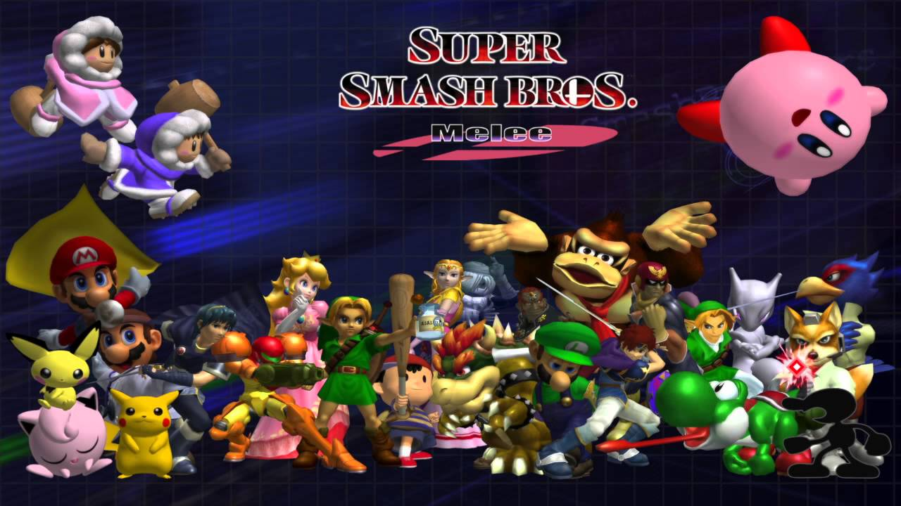
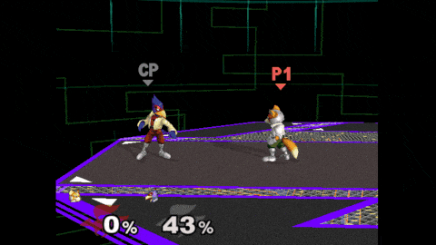
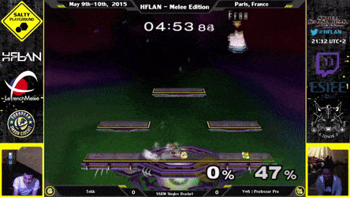
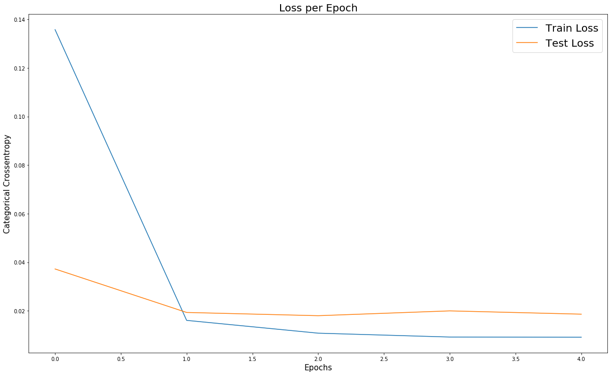

## Problem Statement

Note: For those unfamiliar with Super Smash Bros., I encourage you to read the [context](#context) section.

#### Some Quick Background Info
Fox versus Falco is a frequent match in competitive Melee. Discussions about whether Fox or Falco have the upperhand in the matchup is a popular debate among players. I believe that among today's top ranked players in the world, Fox will most likely win because of his faster speed over Falco. However, Falco is more likely to win against newer players because he is able to utilize different tools to disrupt Fox's momentum; something that new players may struggle to overcome.

#### Exact Problem Statement
Since Falco is often one of the first major hurdles for new players to defeat, I hope to construct a coaching tool that will help them overcome this. The final product will use a collection of Slippi games as input and provide summary statistics on the games. For coaching tools of the product, a player can feed in a collection of Slippi games to learn how a specified player and character plays. Then this will create an AI that someone can battle. This is useful for those who wish to practice against a live player, but does not have immediate access to others. A similar idea to how Super Smash Bros. Wii U utilized [Amiibos](https://www.youtube.com/watch?v=uOnLcVOvrEE). As a quick check to see how feasible this project is, I will train a recurrent neural network on a series of games to see how well the network can learn Fox's wake-up behavior.

  

## Context
#### Further Background Info

### Why Super Smash Bros.?

Super Smash Bros. is a video game series published by Nintendo where video game characters of different franchises battle it out. The second game of the series, Super Smash Bros. Melee, was released in December 2001. This sparked fun parties, happy players, and heated rivalries. These rivalries grew from friend groups, to local neighborhood challenges, to large-scale tournaments by 2002. If you are interested in learning the history of the Super Smash Bros. Melee's competitive scene, I encourage you to watch a docuseries called [The Smash Brothers](https://www.youtube.com/watch?v=NSf2mgkRm7Q&list=PLoUHkRwnRH-IXbZfwlgiEN8eXmoj6DtKM) produced by East Point Pictures.

Many players within this community are dedicated to becoming the best player that they can be. There are many fan-made tools and mods to the game for the purpose of either improving the player experience in training or improving the production of content. Some tools allow players to create save states so that they can easily practice a scenario quickly. Others allow content creators to create replays for the audience to enjoy. Today, I would like to highlight one of these tools, Project Slippi.
- [Website](https://slippi.gg/)
- [Github](https://github.com/project-slippi/project-slippi)
- [Medium](https://medium.com/project-slippi)

### How Does Super Smash Bros. Work?

In this project, I will be only looking at 1v1 tournament legal matches. The criteria for that are:
- The match must be 1v1 with no other players or CPU's in the match.
- The match must be on a tournament legal stage.
- The match must be 8 minutes or less.

In a 1v1 match, players are limited to defeat their opponent with nothing more than the abilities of themselves as a player and the abilities of their selected character. Characters have various moves such as jabs, smash attacks, tilt attacks, special attacks, grabs, and aerial attacks. Most of these attacks have slight variations of themselves, but at different directions. When a player strikes their opponent with an attack, then the opponent's damage percentage goes up.

   
  <b>Fox Damaging Falco</b>

As a character's damage increases, then the distance at which they are launched after a hit then increases. This is beneficial as an opponent because the further they travel for each hit, then it should be easier to push them through a blast zone and have them lose a stock. Once a character loses all their stocks, then the other player is determined the winner. If a timeout occurs, then the player with the most stocks and least damage wins. In the case that those are tied as well, then a rematch is played with each charcter getting one stock.

   
  <b>Jigglypuff Defeating Fox's Last Stock; Winning the Game</b>

### A Primer on Fighting Games

Fighting games is one of the many genres of video games. Two fighting game titles that may sound familiar are Street Fighter and Tekken. These games are unique in that Street Fighter is a 2-dimensional fighter where characters can only move left or right and Tekken characters can move forward, backwards, left or right. While these games are systematically different, they all share similar strategies that a player can utilize. For example, players can play as a heavy brute that can pack a punch, but are slow. Or they can play a glass cannon that can attack with lightning fast speed, but they are easy to kill once their momentum is broken.

The idea of mixups is another common thread among fighting games. One of the most frequent mixup situations that occur in fighting games are when a character is laying on the ground. Usually, the character has one of four options known as get-up options or wake-up options. They can stay on the ground, get up, roll forward, or roll back. The opponent must be able to either predict or quickly react to whichever option the player takes and act accordingly. If the opponent does not capitalize on the player's vulnerability, then the player has a chance to fight back and win.

In Melee, when a character is launched towards the floor, wall, or ceiling, then they have the option to tech. When a player is hit and placed in a this situation they must decide whether to tech in-place, tech-roll left, or tech-roll right. They may miss the 20 frame window and not tech. This will cause them to stay vulnerable on the ground with few options to retaliate. However, like stated before, this is a mixup. If a player frequently techs to the right, then their opponent will be accustomed to that behavior. So whenever the the opponent sees that the player has the option to tech, then they will assume the player will tech right and adjust the combo. If the player suddenly techs in-place and the opponent did not expect that, then the player has recovered safely and is free to move. This process is known as tech chasing - the opponent is tech-chasing the player.

   
  <b>Captain Falcon tech-chasing Fox McCloud</b>

#### How Am I Tackling the Problem Statement?
#### My Process Through the Data Science Workflow?
## Executive Summary

### Data Gathering
To begin, I considered constructing a script that would scrape [Slippi's site](https://slippi.gg) for games that occured during a tournament using the library `selenium`. I opted not to do this because the official Slippi Discord channel has the `!replaydumps` chat command that provides a download link to Slippi files from [Fight Pitt 9](https://smash.gg/tournament/fight-pitt-9-1/details), [Full Bloom 5](https://smash.gg/tournament/full-bloom-5/details), [The Gang Steals the Script](https://smash.gg/tournament/the-gang-steals-the-script/details), and [Pound 2019](https://smash.gg/tournament/pound-2019/details). The source of the data is on a different platform, but each are controlled by the creators and major contributors to the project such as [Fizzi](https://twitter.com/Fizzi36).

### Parsing Data
With the data in hand, I used the `slippi` library to read in each file as a Slippi's own Game object. Game objects have attributes whose values are sometimes other objects. Since each Slippi file has the same structure, I created a function `metadata_to_df` and `frames_to_df` to parse the metadata of each game. The objective here is to filter the games as needed. For example, I want 1v1 games, so I can filter for games where the team battle option is set to off.

### Modeling
Once I have filtered the games I will use as input, I will then create another function to parse the Frame objects of each game. Each Frame object contains information of each frame within the game such as character position and controller inputs. These values will be fed to a recurrent neural network (RNN). The RNN will have a simple topology of a single hidden layer. This is because I am interested to see how well the RNN can learn the players behavior the least amount of complexity possible. If the results were not much better than the baseline accuracy score, then I would increase the complexity of the topology, but cannot due to the below limitations.

#### What Prevented Me From Achieving What I Wanted?
### Limitations
tl;dr Power and money.

When parsing the metadata and frame data from each game, it took a considerable amount of time to execute for all Fight Pitt 9 games. This was a concern because Fight Pitt 9 contained the least amount of games compared to the other tournaments. This lack of power encouraged me only utilize Fight Pitt 9 games.

Since every frame of a game contains multiple features that can be used as inputs to the RNN, there is a lot of data to deal with. If a single game lasts for a minute, then that is 3600 frames (60 seconds * 60 frames per second). Each frame contains 333 features after cleaning and dummying. In short, a lot of power is needed to be able to fit the neural network quickly.

I could use AWS cloud computing to perform the task, but the machine's that were noticeably stronger than my machine cost too much for me at the moment.

## Codebooks
1. [Parsing Fight Pitt 9 Metadata](https://github.com/raffysantayana/slp-predicting-techs-rnn/blob/master/code/01%20-%20Parsing%20Fight%20Pitt%209%20MetaData.ipynb)
2. [Parsing Frame Data](https://github.com/raffysantayana/slp-predicting-techs-rnn/blob/master/code/02%20-%20Parsing%20Frame%20Data.ipynb)
3. [RNN](https://github.com/raffysantayana/slp-predicting-techs-rnn/blob/master/code/03%20-%20RNN%20Fitting.ipynb)

#### I Put Them All In One Section
#### Or You Could Split Them Up
## Conclusions and Future Work

   
  <b>Categorical Cross Entropy Per Epoch</b>

---

  <b>Loss and accuracy scores after fitting model</b>

| Train Loss | Test Loss | Baseline Accuracy | Train Accuracy | Test Accuracy |
|:----------:|:---------:|:-----------------:|:--------------:|:-------------:|
|   0.0091   |   0.0186  |       96.63%      |     99.76%     |     99.63%    |

After fitting the model, the loss on the training sequence is 0.0091 and the loss on the validation sequence is 0.0186. This tells me that my model is overfit because the categorical crossentropy of the training sequences is less than the categorical crossentropy of the testing sequences (validation data). This can also be seen when looking at the train and test accuracies. Considering that my baseline accuracy score is 96.63% and my model has a training accuracy of 99.76% and a test accuracy of 99.63%, I have a model that is better at predicting Fox's tech behavior than randomly guessing. However, it is important to note that the reason that the accuracy score is so high is because majority of the target values are 0's. These 0's represent frames in which Fox is in an action state that does not signify whether he is teching or missing a tech. For example, Fox could be standing, jumping, or attacking.

I would also like to point out the behavior of the test loss. One will notice that the categorical crossentropy at the end of fitting barely shows a difference compared to the categorical crossentropy at the beginning of fitting. This tells me that the training does not have much of an affect on the testing. I believe this is because there is so much random noise for the model to train on that it does not help it predict unseen data at all. So the further versions of this product will need to programmatically find the useful frames that can explain a Fox player's tech habits.

With this in mind I will disregard regularization for now because there is no need to improve this model unless the data that is fed into the model has the useless noise removed. This can be done by locating the frames in which a missed tech, tech in place, tech roll left, or tech roll right is detected. Then I will go back 120 frames and label them as important sequences where 120 is the amount of sequential frames I want to feed to the RNN. By doing this, I can drop the frames that are not labeled as important. This way, I only retain frames that lead up to a wake-up situation. When creating this function, I will also need to construct multiple models that take in sequences of different lengths. I will create models that label 120 frames to 300 frames in 30 frame intervals. In units of seconds, 2 seconds to 5 seconds in 0.5 second intervals. Then for each interval, I will fit a model and determine which number of sequential frames is enough to train a model.

Another problem in the model is the data that is being fed as input. As mentioned before, the data is being inputted as one large sequence of frames. Similar to taping 13 different movie film reels together, we are "taping" 13 different games together for the model to interpret as one large game. This will cause a problem because when the model begins to interpret the frames that are "taped" together, then it will take the history of the previous, independent game and assume it will have an affect on the current game. This is not true at all. To deal with this, I will do research on various types of gates that can be applied to Long Short Term Memory (LSTM) or [GRU] (GRU). From the quick research that I have done, with thanks to Tom Ludlow, I believe the answer is a gate that will allow the recurrent layer to forget the sequences once a new game is being interpretted. By doing so, the model can continue learning without data from previous games leaking through others.

Not quite a limitation, but I found it slightly difficult to truest the [documentation](https://py-slippi.readthedocs.io/en/latest/py-modindex.html) on the python Slippi parser. The values that the documentation explains is not 100% in line with the values that were found in the Fight Pitt 9 Slippi files. When parsing the metadata in the first notebook, warnings occurred that notified us about unknown values in the files. In addition to that, all values for the platform the games were played on shows NINTENDONT. However, this value is not shown in the documentation. If it was not for the Slippi Discord community showing me the [general action states](https://docs.google.com/spreadsheets/d/1JX2w-r2fuvWuNgGb6D3Cs4wHQKLFegZe2jhbBuIhCG8/preview#gid=13) and [character unique action states](https://docs.google.com/spreadsheets/d/1Nu3hSc1U6apOhU4JIJaWRC4Lj0S1inN8BFsq3Y8cFjI/preview), I would not be able to confidently interpret Fox and Falco's action states. I will need to communicate further with the contributors of Slippi to be able to more confidently feed the model accurate values.

Lastly, I will continue creating functions that can take each game and perform summary statistics on each game. For example, mean combo count per game, mean damage per combo, cumulative kill/death ratio, and more.
